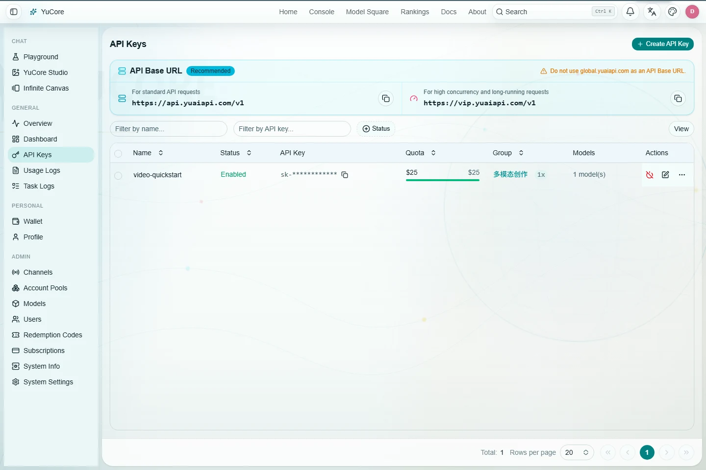
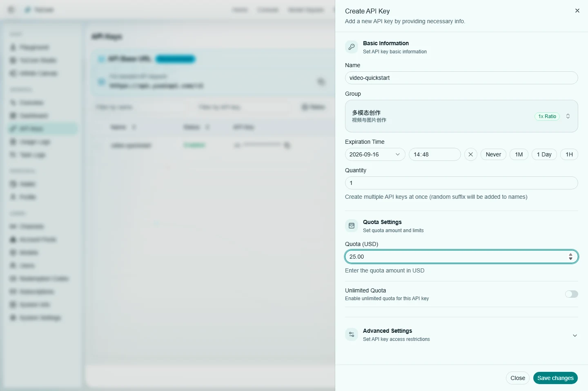
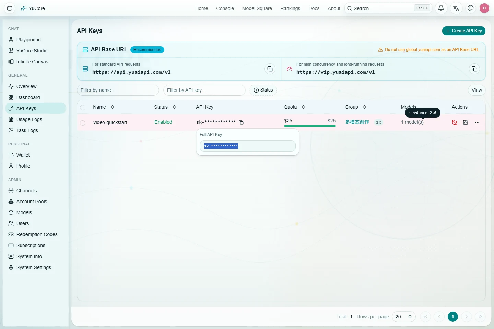

# YuAPI Video API: Generate Your First Video from Scratch

> Your website password is not an API Key. Before calling the API, sign in to YuAPI and create a separate API Key at [`/keys`](/keys). Never place your website password in source code, a terminal command, or a third-party client.

For your first test, select the `多模态创作` group, allow only `seedance-2.0`, and set a short expiration and a small quota. After the workflow succeeds, create a separate production Key for your application.

## 1. Before You Start: Account, API Key, and Task ID

One video generation uses three different values:

| Value | Purpose | Safe to publish? |
| --- | --- | --- |
| Website account and password | Sign in, manage balance, and manage Keys | No |
| API Key | Sent in the `Authorization: Bearer ...` header | No |
| Task ID | Poll the original task and download its result | Share only with trusted support staff when needed |

YuAPI exposes two Base URLs:

| Purpose | Base URL |
| --- | --- |
| Model discovery and ordinary APIs | `https://api.yuaiapi.com/v1` |
| Images, videos, and long-running tasks | `https://vip.yuaiapi.com/v1` |

Both addresses use the same API Keys, model list, account balance, and prices. Your client must select the intended Base URL explicitly. The system does not automatically switch, redirect, or replace either address. All image and video examples in this guide use the second address.

## 2. Create Your First API Key

1. Sign in to YuAPI.
2. Open [`/keys`](/keys).
3. Select **Create API Key**.
4. Enter a descriptive name such as `video-quickstart`.
5. Select the `多模态创作` group shown in the interface.
6. For a first test, use a 24-hour expiration and a `25.00` quota limit.
7. Enable the model restriction and select only `seedance-2.0`.
8. Store the Key immediately after creation. The complete value may not be shown again after you close the dialog.







Do not include a complete Key in a chat, support ticket, or screenshot. Every example below reads `YUAPI_API_KEY` from the environment instead of embedding it in source code.

> Advanced note: some accounts may also show a group named `下游多模态`. It is another selectable group name and does not change the request paths or task protocol in this guide. First-time users should select `多模态创作`.

## 3. Verify the API Key

Start by listing models. This request does not create a video.

Windows PowerShell:

```powershell
$env:YUAPI_API_KEY = Read-Host "Enter your API Key"
$env:YUAPI_BASE_URL = "https://api.yuaiapi.com/v1"

$headers = @{ Authorization = "Bearer $env:YUAPI_API_KEY" }
$models = Invoke-RestMethod `
  -Uri "$env:YUAPI_BASE_URL/models" `
  -Headers $headers `
  -Method Get

$models.data | Where-Object id -eq "seedance-2.0"
```

macOS/Linux:

```bash
read -rsp "YuAPI API Key: " YUAPI_API_KEY && echo
export YUAPI_API_KEY
export YUAPI_BASE_URL="https://api.yuaiapi.com/v1"
export YUAPI_MEDIA_BASE_URL="https://vip.yuaiapi.com/v1"

curl --fail-with-body "$YUAPI_BASE_URL/models" \
  -H "Authorization: Bearer $YUAPI_API_KEY"
```

The response should include `seedance-2.0`. For `401`, verify that the Key was copied in full. For `403`, or when the model is absent, check the Key's group and model restriction.

## 4. Create a Video with seedance-2.0

Create tasks with `POST /v1/videos`. This first request is prompt-only and needs no reference media:

```json
{
  "model": "seedance-2.0",
  "prompt": "A wooden boardwalk beside the sea at dawn, slow forward camera movement, soft natural light, realistic cinematic look",
  "duration": 4,
  "aspect_ratio": "16:9",
  "generate_audio": true
}
```

```bash
curl --fail-with-body -X POST "$YUAPI_MEDIA_BASE_URL/videos" \
  -H "Authorization: Bearer $YUAPI_API_KEY" \
  -H "Content-Type: application/json" \
  -d '{
    "model": "seedance-2.0",
    "prompt": "A wooden boardwalk beside the sea at dawn, slow forward camera movement, soft natural light, realistic cinematic look",
    "duration": 4,
    "aspect_ratio": "16:9",
    "generate_audio": true
  }'
```

A successful response contains `id` or `task_id`. Persist it in your database or job record immediately. A successful create response means that the task entered the queue; it does not mean that the video is complete.

## 5. Poll the Original Task and Download the Video

Always poll with the task ID returned by the create request:

```bash
export TASK_ID="paste the task ID from the create response"

curl "$YUAPI_MEDIA_BASE_URL/videos/$TASK_ID" \
  -H "Authorization: Bearer $YUAPI_API_KEY"
```

When the status is `completed`, `succeeded`, or `success`, download the content:

```bash
curl -L "$YUAPI_MEDIA_BASE_URL/videos/$TASK_ID/content" \
  -H "Authorization: Bearer $YUAPI_API_KEY" \
  --output result.mp4
```

If your client times out, or the task remains `queued` or `processing`, do not submit the create request again. Keep polling the same task ID. Repeating `POST /v1/videos` creates another task and may charge again.

## 6. Turn a Test Key into a Production-Safe Setup

Create a new production Key after testing instead of keeping the test Key indefinitely:

- Use a separate Key for every application and environment.
- Allow only the models the application actually calls.
- Set an acceptable quota limit and expiration, then rotate before expiration.
- Enable an IP restriction when your service has stable outbound addresses.
- Store the Key only in server-side environment variables or a secrets manager.
- Never place it in browser JavaScript, a mobile package, a public repository, or client logs.
- If a Key leaks, delete it, issue a replacement, and review usage records.

## 7. Video Models and Public Prices

These are the per-generation prices for the `多模态创作` group. Polling, reading status, and downloading the same task do not charge again. The model marketplace and your account interface remain the final source for current availability and amounts.

<!-- video-model-catalog:start -->
| Model | `多模态创作` price per generation |
| --- | ---: |
| `grok-video` | 0.9936 |
| `grok-video-1.5` | 2.0016 |
| `happyhouse-1.0` | 6.48 |
| `happyhouse-1.1` | 4.176 |
| `minimax-h3-2k` | 5.04 |
| `omni-fast` | 0.95388 |
| `omni-fast-no-water` | 1.1664 |
| `omni-v2v` | 1.27536 |
| `omni-v2v-no-water` | 1.4904 |
| `sd7-seedance-2.0-1080p` | 7.056 |
| `sd7-seedance-2.0-720p` | 5.616 |
| `sd8-seedance-2.0` | 4.176 |
| `seedance-2.0` | 5.616 |
<!-- video-model-catalog:end -->

Per-video billing is separate from text Token billing and per-image billing. Do not apply text `usage`, cache-hit, or stream-interruption rules to video tasks.

## 8. Video Task Protocol

The four common paths are:

```text
GET  https://api.yuaiapi.com/v1/models
POST https://vip.yuaiapi.com/v1/videos
GET  https://vip.yuaiapi.com/v1/videos/{task_id}
GET  https://vip.yuaiapi.com/v1/videos/{task_id}/content
```

Example create response:

```json
{
  "id": "task_example_01",
  "status": "queued"
}
```

| Status | Action |
| --- | --- |
| `queued`, `processing` | Wait 5-10 seconds, then poll the same ID |
| `completed`, `succeeded`, `success` | Read the result or request `/content` |
| `failed`, `canceled`, `cancelled` | Stop polling and record the error and Request ID |

The result can appear in `video_url`, `metadata.video_url`, `metadata.url`, or `data[0].url`. For failure details, check `error.message`, `reason`, and `message` in that order.

## 9. Model Parameters and Reference Media Limits

| Model | Duration | Resolution | Reference media and notes |
| --- | --- | --- | --- |
| `grok-video` | 4, 6, 8, 10, 12, or 15 seconds | 480p or 720p | Up to 1 reference image |
| `grok-video-1.5` | 4, 6, 8, 10, 12, or 15 seconds | 480p or 720p | Up to 7 reference images |
| `happyhouse-1.0` | 3-15 seconds | 720p or 1080p | Up to 9 images; or one 3-10 second video with up to 5 images; supports `generate_audio` |
| `happyhouse-1.1` | 3-15 seconds | 720p or 1080p | Up to 9 images; supports `generate_audio` |
| `minimax-h3-2k` | 5-15 seconds | Fixed 2K | Up to 5 images and 3 audio files, no more than 8 total |
| `omni-fast*` | Fixed at about 10 seconds | Fixed 720p | Do not send duration, resolution, or audio generation fields |
| `omni-v2v*` | Fixed at about 10 seconds | Fixed 720p | Exactly one source video is required |
| `seedance-2.0` | 4-15 seconds | Fixed 720p | Up to 5 images, 3 videos, and 3 audio files, no more than 11 total |
| `sd7-seedance-2.0-*` | 4-15 seconds | Fixed by model ID | Up to 5 images, 3 videos, and 3 audio files, no more than 11 total |
| `sd8-seedance-2.0` | 5, 10, or 15 seconds | Model-defined | Up to 9 images, 3 videos, and 3 audio files; do not send `resolution` or `generate_audio` |

Reference URLs must be HTTPS resources the server can read without cookies, login state, or a Referer header. Do not record private media URLs in production logs.

```json
{
  "reference_image_urls": ["https://assets.example.com/reference/person.png"],
  "reference_videos": ["https://assets.example.com/reference/motion.mp4"],
  "reference_audios": ["https://assets.example.com/reference/ambient.mp3"]
}
```

## 10. Complete Windows PowerShell Example

```powershell
$mediaBase = "https://vip.yuaiapi.com/v1"
$headers = @{
  Authorization = "Bearer $env:YUAPI_API_KEY"
  "Content-Type" = "application/json"
}
$body = @{
  model = "seedance-2.0"
  prompt = "A boardwalk beside the sea at dawn with slow forward camera motion"
  duration = 4
  aspect_ratio = "16:9"
  generate_audio = $true
} | ConvertTo-Json

$created = Invoke-RestMethod -Uri "$mediaBase/videos" -Method Post -Headers $headers -Body $body
$taskId = if ($created.id) { $created.id } else { $created.task_id }
if (-not $taskId) { throw "Create response did not include a task ID" }
$taskId | Set-Content -Encoding utf8 .\video-task-id.txt
$deadline = (Get-Date).AddMinutes(15)

do {
  Start-Sleep -Seconds 5
  $task = Invoke-RestMethod -Uri "$mediaBase/videos/$taskId" -Headers @{
    Authorization = "Bearer $env:YUAPI_API_KEY"
  }
  $status = [string]$task.status
} while ($status -in @("queued", "processing") -and (Get-Date) -lt $deadline)

if ($status -notin @("completed", "succeeded", "success")) {
  throw "Task is not complete; keep polling the saved task ID: $taskId"
}
Invoke-WebRequest -Uri "$mediaBase/videos/$taskId/content" -Headers @{
  Authorization = "Bearer $env:YUAPI_API_KEY"
} -OutFile .\result.mp4
```

## 11. Complete macOS/Linux curl Example

```bash
set -euo pipefail
: "${YUAPI_API_KEY:?set YUAPI_API_KEY first}"
YUAPI_MEDIA_BASE_URL="https://vip.yuaiapi.com/v1"

created_json="$(curl --fail-with-body -sS -X POST "$YUAPI_MEDIA_BASE_URL/videos" \
  -H "Authorization: Bearer $YUAPI_API_KEY" \
  -H "Content-Type: application/json" \
  -d '{
    "model": "seedance-2.0",
    "prompt": "A boardwalk beside the sea at dawn with slow forward camera motion",
    "duration": 4,
    "aspect_ratio": "16:9",
    "generate_audio": true
  }')"

TASK_ID="$(printf '%s' "$created_json" | python3 -c \
  'import json,sys; d=json.load(sys.stdin); print(d.get("id") or d.get("task_id") or "")')"
test -n "$TASK_ID" || { echo "Create response did not include a task ID" >&2; exit 1; }
printf '%s\n' "$TASK_ID" > video-task-id.txt

deadline=$((SECONDS + 900))
while (( SECONDS < deadline )); do
  task_json="$(curl --fail-with-body -sS "$YUAPI_MEDIA_BASE_URL/videos/$TASK_ID" \
    -H "Authorization: Bearer $YUAPI_API_KEY")"
  status="$(printf '%s' "$task_json" | python3 -c \
    'import json,sys; print(str(json.load(sys.stdin).get("status", "")).lower())')"
  case "$status" in
    completed|succeeded|success) break ;;
    failed|canceled|cancelled) echo "$task_json" >&2; exit 1 ;;
  esac
  sleep 5
done

case "$status" in completed|succeeded|success) ;; *) exit 1 ;; esac
curl --fail-with-body -L "$YUAPI_MEDIA_BASE_URL/videos/$TASK_ID/content" \
  -H "Authorization: Bearer $YUAPI_API_KEY" --output result.mp4
```

## 12. Complete Python Example

Install the dependency with `python -m pip install requests`.

```python
import os
import time
from urllib.parse import urljoin

import requests

base_url = "https://vip.yuaiapi.com/v1"
api_origin = base_url.removesuffix("/v1")
headers = {"Authorization": f"Bearer {os.environ['YUAPI_API_KEY']}"}

created = requests.post(
    f"{base_url}/videos",
    headers=headers,
    json={
        "model": "seedance-2.0",
        "prompt": "A boardwalk beside the sea at dawn with slow forward camera motion",
        "duration": 4,
        "aspect_ratio": "16:9",
        "generate_audio": True,
    },
    timeout=180,
)
created.raise_for_status()
body = created.json()
task_id = body.get("id") or body.get("task_id")
if not task_id:
    raise RuntimeError("Create response did not include a task ID")

SUCCESS = {"completed", "succeeded", "success"}
FAILURE = {"failed", "canceled", "cancelled"}
deadline = time.monotonic() + 15 * 60
task = {}
while time.monotonic() < deadline:
    response = requests.get(f"{base_url}/videos/{task_id}", headers=headers, timeout=60)
    response.raise_for_status()
    task = response.json()
    status = str(task.get("status", "")).lower()
    if status in SUCCESS:
        break
    if status in FAILURE:
        raise RuntimeError(f"video task failed: {task}")
    time.sleep(5)
else:
    raise TimeoutError(f"video task still processing: {task_id}")

metadata = task.get("metadata") or {}
data = task.get("data") or []
video_url = task.get("video_url") or metadata.get("video_url") or metadata.get("url") or (data[0].get("url") if data else None)
if video_url:
    print(urljoin(api_origin, video_url))

content = requests.get(f"{base_url}/videos/{task_id}/content", headers=headers, timeout=180)
content.raise_for_status()
with open("result.mp4", "wb") as output:
    output.write(content.content)
```

## 13. Node.js Server Example

Run this example only on a trusted server. Never put it in browser JavaScript. Node.js 20 and newer include `fetch`.

```javascript
import { writeFile } from 'node:fs/promises'

const baseUrl = 'https://vip.yuaiapi.com/v1'
const apiKey = process.env.YUAPI_API_KEY
if (!apiKey) throw new Error('YUAPI_API_KEY is required')
const authHeaders = { Authorization: `Bearer ${apiKey}` }

const createdResponse = await fetch(`${baseUrl}/videos`, {
  method: 'POST',
  headers: { ...authHeaders, 'Content-Type': 'application/json' },
  body: JSON.stringify({
    model: 'seedance-2.0',
    prompt: 'A boardwalk beside the sea at dawn with slow forward camera motion',
    duration: 4,
    aspect_ratio: '16:9',
    generate_audio: true,
  }),
})
if (!createdResponse.ok) throw new Error(await createdResponse.text())
const created = await createdResponse.json()
const taskId = created.id ?? created.task_id
if (!taskId) throw new Error('Create response did not include a task ID')

const deadline = Date.now() + 15 * 60 * 1000
let status = ''
while (Date.now() < deadline) {
  const response = await fetch(`${baseUrl}/videos/${taskId}`, { headers: authHeaders })
  if (!response.ok) throw new Error(await response.text())
  const task = await response.json()
  status = String(task.status ?? '').toLowerCase()
  if (['completed', 'succeeded', 'success'].includes(status)) break
  if (['failed', 'canceled', 'cancelled'].includes(status)) throw new Error(JSON.stringify(task))
  await new Promise((resolve) => setTimeout(resolve, 5000))
}
if (!['completed', 'succeeded', 'success'].includes(status)) throw new Error(`Task is still processing: ${taskId}`)

const content = await fetch(`${baseUrl}/videos/${taskId}/content`, { headers: authHeaders })
if (!content.ok) throw new Error(await content.text())
await writeFile('result.mp4', Buffer.from(await content.arrayBuffer()))
```

## 14. Status, Errors, and Safe Retries

| HTTP status | Common cause | Correct action |
| --- | --- | --- |
| `400` | A parameter or reference does not meet model requirements | Correct the request; do not replay it unchanged |
| `401` | The Key is invalid, expired, or deleted | Check the Bearer header and rotate the Key |
| `403` | Group, model permission, quota, or account state blocks the request | Review the Key and account settings |
| `404` | The model or task does not exist | List models again and verify the original task ID |
| `429` | Concurrency or rate limit | Reduce concurrency and apply exponential backoff |
| `500/502/503/504` | Temporary service failure or long-task timeout | Poll a saved task ID first, then decide whether a new task is needed |

Poll every 5-10 seconds and set an application deadline. Logs may contain timestamps, paths, model IDs, task IDs, status codes, and Request IDs. They must not contain complete Keys, website passwords, or private media.

## 15. Pre-Integration Checklist

- [ ] Created an API Key at `/keys` instead of using the website password.
- [ ] Restricted the test Key to the required models.
- [ ] Confirmed the model ID with `GET /v1/models`.
- [ ] Used `https://vip.yuaiapi.com/v1` for image and video requests.
- [ ] Persisted the task ID from the create response.
- [ ] Poll the original task during `queued` or `processing`; never create a duplicate task as a polling strategy.
- [ ] Configured a separate production quota, expiration, model list, and optional IP restriction.
- [ ] Kept the Key only on a trusted server.
- [ ] Confirmed reference media is directly readable and within model limits.
- [ ] Handles success, failure, cancellation, and timeout states.

## 16. Image API Reference

Image generation is synchronous and does not use the video polling workflow:

- Generation: `POST /v1/images/generations`
- Editing: `POST /v1/images/edits`
- Request only `n=1`
- Read `data[0].url` or `data[0].b64_json` from a successful response

| Model | Fixed tier | Price per image |
| --- | ---: | ---: |
| `gpt-image-2-1k` | 1K | 0.0325 |
| `gpt-image-2-2k` | 2K | 0.0650 |
| `gpt-image-2-4k` | 4K | 0.1040 |
| `nano-banana-pro-1k` | 1K | 0.1040 |
| `nano-banana-pro-2k` | 2K | 0.1300 |
| `nano-banana-pro-4k` | 4K | 0.1937 |
| `nano-banana2-1k` | 1K | 0.0767 |
| `nano-banana2-2k` | 2K | 0.1040 |
| `nano-banana2-4k` | 4K | 0.1560 |
| `grok-imagine-image` | Standard | 0.072 |
| `grok-imagine-image-quality` | High quality | 0.072 |

`grok-4.5` is a text model. `grok-imagine-image` and `grok-imagine-image-quality` are image models. `grok-video` and `grok-video-1.5` are asynchronous video models. Always use the exact model ID and its corresponding endpoint.

```bash
curl --fail-with-body -X POST "$YUAPI_MEDIA_BASE_URL/images/generations" \
  -H "Authorization: Bearer $YUAPI_API_KEY" \
  -H "Content-Type: application/json" \
  -d '{
    "model": "gpt-image-2-1k",
    "prompt": "A cinematic city street after rain, realistic photography, no text",
    "n": 1,
    "response_format": "url"
  }'
```

```bash
curl --fail-with-body -X POST "$YUAPI_MEDIA_BASE_URL/images/edits" \
  -H "Authorization: Bearer $YUAPI_API_KEY" \
  -F "model=gpt-image-2-1k" \
  -F "prompt=Keep the subject structure and apply an editorial cover style without text" \
  -F "image=@./input.png" \
  -F "n=1" \
  -F "response_format=url"
```

Result URLs may expire. Download long-lived results into storage you control, and comply with copyright and privacy requirements for all media.
