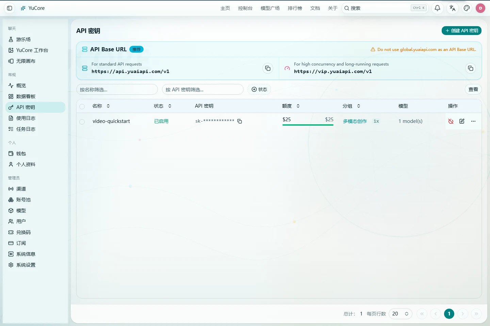
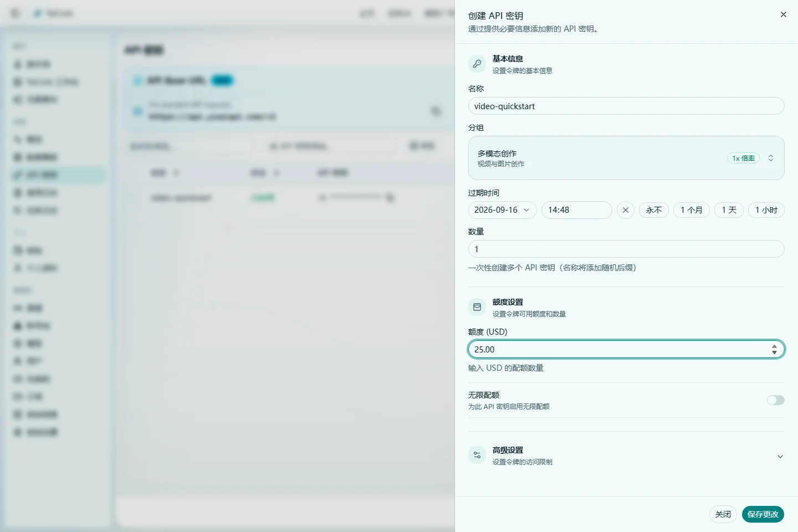
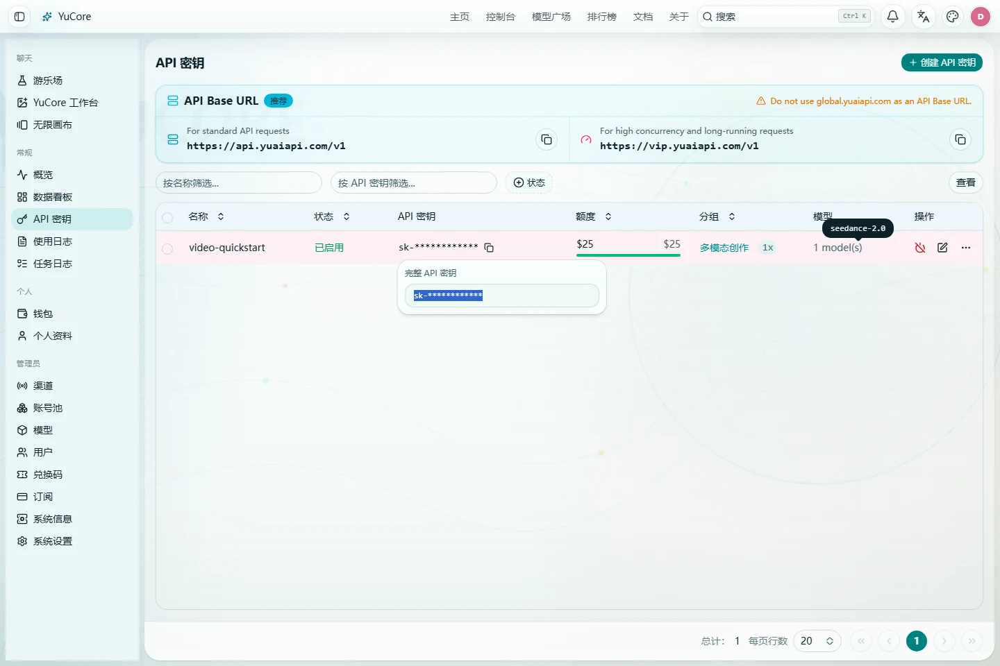

# YuAPI 视频 API：从零开始生成第一个视频

> 网站登录密码不是 API Key。程序调用前，请先登录 YuAPI，然后在 [`/keys`](/keys) 创建独立的 API Key。不要把网站密码填写到代码、命令行或第三方客户端中。

第一次测试建议选择 `多模态创作` 分组，只允许 `seedance-2.0`，设置较短有效期和较小额度。确认调用流程正确后，再为正式应用创建单独的生产 Key。

## 1. 开始前：账号、API Key 和任务 ID

完成一次视频生成会用到三个不同的值：

| 名称 | 用途 | 是否可以公开 |
| --- | --- | --- |
| 网站账号和密码 | 登录控制台、管理余额和 Key | 不可以 |
| API Key | 放在 `Authorization: Bearer ...` 请求头中 | 不可以 |
| 任务 ID | 查询同一次视频任务和下载结果 | 只应提供给需要排障的可信人员 |

YuAPI 提供两个 Base URL：

| 用途 | Base URL |
| --- | --- |
| 查询模型和普通 API | `https://api.yuaiapi.com/v1` |
| 图片、视频和长任务 | `https://vip.yuaiapi.com/v1` |

两个地址共用同一套 API Key、模型列表、账户余额和价格。用户需要在客户端中明确选择要使用的 Base URL；系统不会自动切换、重定向或替换这两个地址。本文所有图片和视频示例都使用第二个地址。

## 2. 创建你的第一个 API Key

1. 登录 YuAPI。
2. 打开 [`/keys`](/keys)。
3. 点击“创建 API Key”。
4. 名称填写容易识别的用途，例如 `video-quickstart`。
5. 分组选择 `多模态创作`。
6. 第一次测试建议设置 24 小时有效期和 `25.00` 的额度上限。
7. 打开模型限制，只选择 `seedance-2.0`。
8. 创建后立即保存 Key。关闭显示窗口后，完整值可能不会再次出现。







不要把完整 Key 发到聊天、工单或截图中。本文统一使用环境变量 `YUAPI_API_KEY`，不会在示例里硬编码 Key。

> 高级说明：部分账户可能还会看到 `下游多模态` 分组。它只是另一个可选分组名称，不改变本文的请求路径和任务协议；新手请使用 `多模态创作`。

## 3. 验证 API Key

先查询模型列表。这个请求不会创建视频。

Windows PowerShell：

```powershell
$env:YUAPI_API_KEY = Read-Host "请输入 API Key"
$env:YUAPI_BASE_URL = "https://api.yuaiapi.com/v1"

$headers = @{ Authorization = "Bearer $env:YUAPI_API_KEY" }
$models = Invoke-RestMethod `
  -Uri "$env:YUAPI_BASE_URL/models" `
  -Headers $headers `
  -Method Get

$models.data | Where-Object id -eq "seedance-2.0"
```

macOS/Linux：

```bash
read -rsp "YuAPI API Key: " YUAPI_API_KEY && echo
export YUAPI_API_KEY
export YUAPI_BASE_URL="https://api.yuaiapi.com/v1"
export YUAPI_MEDIA_BASE_URL="https://vip.yuaiapi.com/v1"

curl --fail-with-body "$YUAPI_BASE_URL/models" \
  -H "Authorization: Bearer $YUAPI_API_KEY"
```

结果中应存在 `seedance-2.0`。如果返回 `401`，检查 Key 是否复制完整；如果返回 `403` 或列表中没有该模型，检查 Key 的分组和模型限制。

## 4. 使用 seedance-2.0 创建视频

创建接口是 `POST /v1/videos`。下面是第一个纯文本生成请求，不需要准备图片或视频素材：

```json
{
  "model": "seedance-2.0",
  "prompt": "清晨的海边木栈道，镜头缓慢向前推进，柔和自然光，真实电影质感",
  "duration": 4,
  "aspect_ratio": "16:9",
  "generate_audio": true
}
```

```bash
curl --fail-with-body -X POST "$YUAPI_MEDIA_BASE_URL/videos" \
  -H "Authorization: Bearer $YUAPI_API_KEY" \
  -H "Content-Type: application/json" \
  -d '{
    "model": "seedance-2.0",
    "prompt": "清晨的海边木栈道，镜头缓慢向前推进，柔和自然光，真实电影质感",
    "duration": 4,
    "aspect_ratio": "16:9",
    "generate_audio": true
  }'
```

成功响应会包含 `id` 或 `task_id`。立即把它保存到自己的数据库或任务记录中。创建成功只表示任务已经进入队列，不表示视频已经完成。

## 5. 查询原任务并下载视频

查询时必须使用创建响应中的原任务 ID：

```bash
export TASK_ID="把创建响应中的任务 ID 填在这里"

curl "$YUAPI_MEDIA_BASE_URL/videos/$TASK_ID" \
  -H "Authorization: Bearer $YUAPI_API_KEY"
```

当状态为 `completed`、`succeeded` 或 `success` 时下载内容：

```bash
curl -L "$YUAPI_MEDIA_BASE_URL/videos/$TASK_ID/content" \
  -H "Authorization: Bearer $YUAPI_API_KEY" \
  --output result.mp4
```

如果客户端超时，或者任务仍是 `queued`、`processing`，不要再次发送创建请求。继续查询同一个任务 ID。重复 `POST /v1/videos` 会创建另一条任务，并可能再次计费。

## 6. 把测试 Key 调整为生产安全配置

测试通过后，不建议直接长期使用测试 Key。请新建生产 Key，并完成以下设置：

- 每个应用和环境使用独立 Key，例如开发、预发布、生产分别创建。
- 只允许应用实际使用的模型，不要默认开放全部模型。
- 设置可接受的额度上限和有效期，并在到期前轮换。
- 有固定出口 IP 时启用 IP 限制。
- 只把 Key 放在服务端环境变量或密钥管理系统中。
- 不要在浏览器 JavaScript、移动应用包、公开仓库或客户端日志里保存 Key。
- Key 泄露后立即删除旧 Key、创建新 Key，并检查使用记录。

## 7. 视频模型与公开价格

下面是 `多模态创作` 分组的单次视频生成价格。查询任务、读取状态和下载同一任务不会再次扣费。最终可用模型和金额仍以模型广场及账户界面为准。

<!-- video-model-catalog:start -->
| 模型 | `多模态创作` 单次价格 |
| --- | ---: |
| `grok-video` | 0.9936 |
| `grok-video-1.5` | 2.0016 |
| `happyhouse-1.0` | 6.48 |
| `happyhouse-1.1` | 4.176 |
| `minimax-h3-2k` | 5.04 |
| `omni-fast` | 0.95388 |
| `omni-fast-no-water` | 1.1664 |
| `omni-v2v` | 1.27536 |
| `omni-v2v-no-water` | 1.4904 |
| `sd7-seedance-2.0-1080p` | 7.056 |
| `sd7-seedance-2.0-720p` | 5.616 |
| `sd8-seedance-2.0` | 4.176 |
| `seedance-2.0` | 5.616 |
<!-- video-model-catalog:end -->

视频按次计费与文本 Token 计费、图片按张计费彼此独立。不要把文本接口的 `usage` 字段、缓存命中规则或流式中断规则套用到视频任务。

## 8. 视频任务协议

四个常用路径如下：

```text
GET  https://api.yuaiapi.com/v1/models
POST https://vip.yuaiapi.com/v1/videos
GET  https://vip.yuaiapi.com/v1/videos/{task_id}
GET  https://vip.yuaiapi.com/v1/videos/{task_id}/content
```

创建响应示例：

```json
{
  "id": "task_example_01",
  "status": "queued"
}
```

查询响应中的常用字段：

| 字段 | 说明 |
| --- | --- |
| `id` 或 `task_id` | 原任务 ID |
| `status` | 当前状态 |
| `progress` | 进度，可能是数字或带 `%` 的字符串 |
| `video_url` | 完成后可能出现的结果 URL |
| `metadata.video_url`、`metadata.url` | 其他可能的结果位置 |
| `data[0].url` | 兼容响应中的结果位置 |
| `error.message`、`reason`、`message` | 失败原因 |

状态处理：

| 状态 | 操作 |
| --- | --- |
| `queued`、`processing` | 等待 5-10 秒后查询同一 ID |
| `completed`、`succeeded`、`success` | 读取结果或请求 `/content` |
| `failed`、`canceled`、`cancelled` | 停止查询并记录错误和 Request ID |

## 9. 模型参数与参考素材限制

| 模型 | 时长 | 分辨率 | 参考素材和注意事项 |
| --- | --- | --- | --- |
| `grok-video` | 4、6、8、10、12、15 秒 | 480p、720p | 最多 1 张参考图 |
| `grok-video-1.5` | 4、6、8、10、12、15 秒 | 480p、720p | 最多 7 张参考图 |
| `happyhouse-1.0` | 3-15 秒 | 720p、1080p | 最多 9 张图；或 1 条 3-10 秒视频加最多 5 张图，总数不超过 9；支持 `generate_audio` |
| `happyhouse-1.1` | 3-15 秒 | 720p、1080p | 最多 9 张图；支持 `generate_audio` |
| `minimax-h3-2k` | 5-15 秒 | 固定 2K | 最多 5 张图和 3 条音频，总数不超过 8；首尾帧模式不能同时生成音频 |
| `omni-fast*` | 固定约 10 秒 | 固定 720p | 只传 `aspect_ratio` 和参考图；不要传时长、分辨率或音频开关 |
| `omni-v2v*` | 固定约 10 秒 | 固定 720p | 必须且只能提供 1 条源视频 |
| `seedance-2.0` | 4-15 秒 | 固定 720p | 最多 5 张图、3 条视频、3 条音频，总数不超过 11；支持 `generate_audio` |
| `sd7-seedance-2.0-*` | 4-15 秒 | 由模型 ID 固定 | 最多 5 张图、3 条视频、3 条音频，总数不超过 11；支持 `generate_audio` |
| `sd8-seedance-2.0` | 5、10、15 秒 | 模型固定 | 最多 9 张图、3 条视频、3 条音频，总数不超过 15；不要传 `resolution` 或 `generate_audio` |

参考素材 URL 必须是服务端无需 Cookie、登录态或 Referer 就能读取的 HTTPS 地址。正式环境应限制文件大小和时长，并避免在日志中记录私密素材 URL。

常用参考字段：

```json
{
  "reference_image_urls": ["https://assets.example.com/reference/person.png"],
  "reference_videos": ["https://assets.example.com/reference/motion.mp4"],
  "reference_audios": ["https://assets.example.com/reference/ambient.mp3"]
}
```

## 10. Windows PowerShell 完整示例

```powershell
$mediaBase = "https://vip.yuaiapi.com/v1"
$headers = @{
  Authorization = "Bearer $env:YUAPI_API_KEY"
  "Content-Type" = "application/json"
}

$body = @{
  model = "seedance-2.0"
  prompt = "清晨的海边木栈道，镜头缓慢向前推进，柔和自然光"
  duration = 4
  aspect_ratio = "16:9"
  generate_audio = $true
} | ConvertTo-Json

$created = Invoke-RestMethod `
  -Uri "$mediaBase/videos" `
  -Method Post `
  -Headers $headers `
  -Body $body

$taskId = if ($created.id) { $created.id } else { $created.task_id }
if (-not $taskId) { throw "创建响应缺少任务 ID" }
$taskId | Set-Content -Encoding utf8 .\video-task-id.txt

$deadline = (Get-Date).AddMinutes(15)
do {
  Start-Sleep -Seconds 5
  $task = Invoke-RestMethod `
    -Uri "$mediaBase/videos/$taskId" `
    -Method Get `
    -Headers @{ Authorization = "Bearer $env:YUAPI_API_KEY" }
  $status = [string]$task.status
  Write-Host "状态: $status"
} while ($status -in @("queued", "processing") -and (Get-Date) -lt $deadline)

if ($status -notin @("completed", "succeeded", "success")) {
  throw "任务未完成，请保留任务 ID 继续查询: $taskId"
}

Invoke-WebRequest `
  -Uri "$mediaBase/videos/$taskId/content" `
  -Headers @{ Authorization = "Bearer $env:YUAPI_API_KEY" } `
  -OutFile .\result.mp4
```

## 11. macOS/Linux curl 完整示例

```bash
set -euo pipefail
: "${YUAPI_API_KEY:?请先设置 YUAPI_API_KEY}"
YUAPI_MEDIA_BASE_URL="https://vip.yuaiapi.com/v1"

created_json="$(curl --fail-with-body -sS -X POST "$YUAPI_MEDIA_BASE_URL/videos" \
  -H "Authorization: Bearer $YUAPI_API_KEY" \
  -H "Content-Type: application/json" \
  -d '{
    "model": "seedance-2.0",
    "prompt": "清晨的海边木栈道，镜头缓慢向前推进，柔和自然光",
    "duration": 4,
    "aspect_ratio": "16:9",
    "generate_audio": true
  }')"

TASK_ID="$(printf '%s' "$created_json" | python3 -c \
  'import json,sys; d=json.load(sys.stdin); print(d.get("id") or d.get("task_id") or "")')"
test -n "$TASK_ID" || { echo "创建响应缺少任务 ID" >&2; exit 1; }
printf '%s\n' "$TASK_ID" > video-task-id.txt

deadline=$((SECONDS + 900))
while (( SECONDS < deadline )); do
  task_json="$(curl --fail-with-body -sS \
    "$YUAPI_MEDIA_BASE_URL/videos/$TASK_ID" \
    -H "Authorization: Bearer $YUAPI_API_KEY")"
  status="$(printf '%s' "$task_json" | python3 -c \
    'import json,sys; print(str(json.load(sys.stdin).get("status", "")).lower())')"
  case "$status" in
    completed|succeeded|success) break ;;
    failed|canceled|cancelled) echo "$task_json" >&2; exit 1 ;;
  esac
  sleep 5
done

case "$status" in
  completed|succeeded|success) ;;
  *) echo "任务仍在处理中，请继续查询任务 ID: $TASK_ID" >&2; exit 1 ;;
esac

curl --fail-with-body -L \
  "$YUAPI_MEDIA_BASE_URL/videos/$TASK_ID/content" \
  -H "Authorization: Bearer $YUAPI_API_KEY" \
  --output result.mp4
```

## 12. Python 完整示例

先安装依赖：`python -m pip install requests`。

```python
import os
import time
from urllib.parse import urljoin

import requests

base_url = "https://vip.yuaiapi.com/v1"
api_origin = base_url.removesuffix("/v1")
headers = {"Authorization": f"Bearer {os.environ['YUAPI_API_KEY']}"}

created = requests.post(
    f"{base_url}/videos",
    headers=headers,
    json={
        "model": "seedance-2.0",
        "prompt": "清晨的海边木栈道，镜头缓慢向前推进，柔和自然光",
        "duration": 4,
        "aspect_ratio": "16:9",
        "generate_audio": True,
    },
    timeout=180,
)
created.raise_for_status()
created_body = created.json()
task_id = created_body.get("id") or created_body.get("task_id")
if not task_id:
    raise RuntimeError("创建响应缺少任务 ID")

SUCCESS = {"completed", "succeeded", "success"}
FAILURE = {"failed", "canceled", "cancelled"}
deadline = time.monotonic() + 15 * 60
task = {}

while time.monotonic() < deadline:
    response = requests.get(
        f"{base_url}/videos/{task_id}", headers=headers, timeout=60
    )
    response.raise_for_status()
    task = response.json()
    status = str(task.get("status", "")).lower()
    if status in SUCCESS:
        break
    if status in FAILURE:
        raise RuntimeError(f"video task failed: {task}")
    time.sleep(5)
else:
    raise TimeoutError(f"video task still processing: {task_id}")

metadata = task.get("metadata") or {}
data = task.get("data") or []
video_url = (
    task.get("video_url")
    or metadata.get("video_url")
    or metadata.get("url")
    or (data[0].get("url") if data else None)
)
if video_url:
    print(urljoin(api_origin, video_url))

content = requests.get(
    f"{base_url}/videos/{task_id}/content", headers=headers, timeout=180
)
content.raise_for_status()
with open("result.mp4", "wb") as output:
    output.write(content.content)
```

## 13. Node.js 服务端示例

此示例只能运行在可信服务端，不能放进浏览器 JavaScript。Node.js 20 及以上版本可直接使用内置 `fetch`：

```javascript
import { writeFile } from 'node:fs/promises'

const baseUrl = 'https://vip.yuaiapi.com/v1'
const apiKey = process.env.YUAPI_API_KEY
if (!apiKey) throw new Error('YUAPI_API_KEY is required')

const headers = {
  Authorization: `Bearer ${apiKey}`,
  'Content-Type': 'application/json',
}

const createdResponse = await fetch(`${baseUrl}/videos`, {
  method: 'POST',
  headers,
  body: JSON.stringify({
    model: 'seedance-2.0',
    prompt: '清晨的海边木栈道，镜头缓慢向前推进，柔和自然光',
    duration: 4,
    aspect_ratio: '16:9',
    generate_audio: true,
  }),
})
if (!createdResponse.ok) throw new Error(await createdResponse.text())
const created = await createdResponse.json()
const taskId = created.id ?? created.task_id
if (!taskId) throw new Error('创建响应缺少任务 ID')

const deadline = Date.now() + 15 * 60 * 1000
let status = ''
while (Date.now() < deadline) {
  const response = await fetch(`${baseUrl}/videos/${taskId}`, {
    headers: { Authorization: `Bearer ${apiKey}` },
  })
  if (!response.ok) throw new Error(await response.text())
  const task = await response.json()
  status = String(task.status ?? '').toLowerCase()
  if (['completed', 'succeeded', 'success'].includes(status)) break
  if (['failed', 'canceled', 'cancelled'].includes(status)) {
    throw new Error(JSON.stringify(task))
  }
  await new Promise((resolve) => setTimeout(resolve, 5000))
}
if (!['completed', 'succeeded', 'success'].includes(status)) {
  throw new Error(`任务仍在处理中: ${taskId}`)
}

const content = await fetch(`${baseUrl}/videos/${taskId}/content`, {
  headers: { Authorization: `Bearer ${apiKey}` },
})
if (!content.ok) throw new Error(await content.text())
await writeFile('result.mp4', Buffer.from(await content.arrayBuffer()))
```

## 14. 状态、错误和安全重试

| HTTP 状态 | 常见原因 | 正确处理 |
| --- | --- | --- |
| `400` | 参数、素材格式、时长或分辨率不符合模型要求 | 修正请求，不要原样重试 |
| `401` | Key 无效、过期或已删除 | 检查 Bearer 请求头并轮换 Key |
| `403` | 分组、模型权限、额度或账户状态不允许 | 检查 Key 配置和账户状态 |
| `404` | 模型或任务不存在 | 重新查询模型列表并核对原任务 ID |
| `409` | 请求状态冲突 | 读取响应信息，不要盲目重复创建 |
| `429` | 并发或速率限制 | 降低并发并指数退避 |
| `500/502/503/504` | 服务暂时不可用或长任务等待超时 | 先用已保存的任务 ID 查询，再决定是否发起新任务 |

建议每 5-10 秒查询一次，最长等待时间由应用自行设置。排障日志可以保存请求时间、路径、模型 ID、任务 ID、状态码和 Request ID，但不能保存完整 Key、网站密码或私密素材内容。

## 15. 接入前检查清单

- [ ] 已在 `/keys` 创建 API Key，而不是使用网站密码。
- [ ] 测试 Key 使用 `多模态创作`，只允许需要的模型。
- [ ] `GET /v1/models` 能看到准备调用的模型 ID。
- [ ] 图片和视频请求使用 `https://vip.yuaiapi.com/v1`。
- [ ] 创建响应中的任务 ID 已持久化。
- [ ] `queued` 或 `processing` 时只查询原任务，不重复创建。
- [ ] 生产 Key 有独立额度、有效期、模型和可选 IP 限制。
- [ ] Key 只存在于可信服务端，不出现在浏览器、仓库或日志中。
- [ ] 参考素材无需登录即可由服务端读取，且符合模型限制。
- [ ] 应用会处理成功、失败、取消和超时状态。

## 16. 图片 API 参考

图片生成是同步接口，和视频任务的轮询流程不同。使用同一个 `YUAPI_API_KEY` 和媒体 Base URL：

- 文生图：`POST /v1/images/generations`
- 图片编辑：`POST /v1/images/edits`
- 每次只请求 `n=1`
- 成功结果读取 `data[0].url` 或 `data[0].b64_json`

### 图片模型与公开价格

| 模型 | 固定档位 | 单张价格 |
| --- | ---: | ---: |
| `gpt-image-2-1k` | 1K | 0.0325 |
| `gpt-image-2-2k` | 2K | 0.0650 |
| `gpt-image-2-4k` | 4K | 0.1040 |
| `nano-banana-pro-1k` | 1K | 0.1040 |
| `nano-banana-pro-2k` | 2K | 0.1300 |
| `nano-banana-pro-4k` | 4K | 0.1937 |
| `nano-banana2-1k` | 1K | 0.0767 |
| `nano-banana2-2k` | 2K | 0.1040 |
| `nano-banana2-4k` | 4K | 0.1560 |
| `grok-imagine-image` | 标准 | 0.072 |
| `grok-imagine-image-quality` | 高质量 | 0.072 |

`grok-4.5` 是文本模型；`grok-imagine-image` 和 `grok-imagine-image-quality` 是图片模型；`grok-video` 和 `grok-video-1.5` 是异步视频模型。它们不能通过更换提示词互相转换，请始终使用准确模型 ID 和对应接口。

文生图：

```bash
curl --fail-with-body -X POST "$YUAPI_MEDIA_BASE_URL/images/generations" \
  -H "Authorization: Bearer $YUAPI_API_KEY" \
  -H "Content-Type: application/json" \
  -d '{
    "model": "gpt-image-2-1k",
    "prompt": "雨后城市街道的电影感夜景，真实摄影，无文字",
    "n": 1,
    "response_format": "url"
  }'
```

图片编辑：

```bash
curl --fail-with-body -X POST "$YUAPI_MEDIA_BASE_URL/images/edits" \
  -H "Authorization: Bearer $YUAPI_API_KEY" \
  -F "model=gpt-image-2-1k" \
  -F "prompt=保持主体结构，改为高级杂志封面风格，无文字" \
  -F "image=@./input.png" \
  -F "n=1" \
  -F "response_format=url"
```

结果 URL 可能有有效期。需要长期保存时，请及时下载到自己的受控存储，并遵守素材版权和隐私要求。
